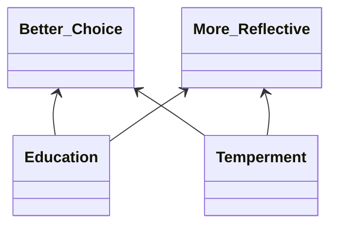

# Info
**Title**: Comparing fast thinking and slow thinking: The relative benefits of interventions, individual differences, and inferential rules
**Journal**: Judgment and Decision Making
**Year**: 2020
**Authors**: [[M. Asher Lawson]], [[Richard P. Larrick]], [[Jack B. Soll]]

**Link**: [paperpile](chrome-extension://bomfdkbfpdhijjbeoicnfhjbdhncfhig/view.html?mp=wRlnvf9y)
**Tags**: #paper
**Rating**: #3star 

---
**Connections**:
[[individual differences]]
[[behavioral intervention]]
[[thesis intervention]]
[[dual-process model]]
[[rule based reasoning]]
[[cognitive reflection test]]
[[system 1]]
[[system 2]]
[[debiasing]]
[[cognitive reflection test]]

# Notes
## Summary
Large scale study (1700 participants)
**Question**: Does ==slowing down== and accessing [[system 2]] really improve decisions?

[[Daniel Kahneman]] points out that if you don't have access to the necessary rule/algo for solving a problem, or recognize that the rule applies in a given situation then thinking more slowly is unlikely to help (2000).

Point out that while there is support for idea that people who are more reflective (trait) tend to be less prone to common decision bias (Frederick,2005; Oeschssler, Roider & Schmitz, 2009; Cokely & Kelley, 2009; Obrecht, Chapman & Gelman, 2009; Koehler & James, 2010), this does not mean that someone more prone can change by slowing down...

- some evidence suggests that people may reach correct answers by having ==good intuitions==, **rather than** by using ==deliberation== to correct bad intuitions (Thompson, Pennycook, Trippas& Evans, 2018; Raoelison, Thompson & De Neys, 2020)

- study focuses on [[statistical reasoning]]
- admit that questions have low [[ecological validity]]

**[[behavioral intervention|Behavioral Interventions]]**
[[internal behavioral intervention|Internal]] vs [[external behavioral intervention|External]]

- Authors point out that [[intuitive decision making]] can often be accurate.
	- i.e. fast [[system 1]] choices.

- [[mindware]]/[[cognitive capital]] discussed
- ==deliberation== important in **choosing between competing intuitions**, rather than actually **calculating** [[normative]] responses to substitute for an incorrect intuition (De Neys & Pennycook, 2019)

- comment on idea that the [[cognitive reflection test]] is actually measuring one's degree of [[reflective cognitive style]] (Baron, Scott, Fincher & Metz, 2015).

- discuss previous work which has found that [[time pressure]] conditions generally hurts performance across a wide range of tasks, and that [[cognitive load]] also impairs performance on reasoning problems

### The Questions

##### Main Question
> Does slow thinking improve performance relative to a control condition in which people think at their own, self-directed pace?

**Question 1**
>Are people more accurate on JDM problems when they score more highly on individual difference measures such as the CRT?

This was the case. CRT, CRT-2 and BNT all explained unique variance in performance.

For example: "Average performance was monotonically increasing in CRT, with a one-point increase in the CRT associated with a 9.5 percentage point increase in accuracy."

**Question 2**
>Are people more accurate on JDM problems in a slow thinking condition than in a fast thinking condition?

Participants in the Fast condition had an average accuracy of 52.2%, relative to 58.9% in the control condition and 61.6% in the Slow condition.

For context, the average difference in performance between asking respondents to engage in fast thinking and slow thinking was approximately equivalent to the average difference in performance between two respondents whose CRT scores differ by one point.

**Question 3a**
>Are people less accurate on JDM problems in a fast thinking condition compared to a control condition?

Yes.

**Question 3b**
>Are people more accurate on JDM problems in a slow thinking condition compared to a control condition?

**Fast** harmed performance accuracy by 6.7 percentage points, **Slow** yielded a gain of only 2.7 percentage points, relative to the control.

Authors point out that this may have been partly due to fact that there was greater compliance with "fast" directions than with "slow" directions...(easier)

---
Discuss idea of a ==neutral problem==, one in which you strip out any content that is likely to evoke a heuristic-based intuitive answer, in order to get an unbiased measure of whether a participant has the [[mindware]] to correctly solve a problem.

- Šrol and De Neys (2020) created a [[mindware instantiation index]]

Authors try and disentangle two aspects of [[mindware]]:
1. **access** to specific rules
2. [[individual differences]] that contribute to successful **application** of knowledge

To estimate access used [[neutral problems]], similar to those used by:
- Frey et al.(2018)
- [[Srol_J_2020_Predicting individual differences in conflict detection and bias susceptibility during reasoning]].

**Question 4**
>Are people who have access to a specific inferential rule more accurate on directly related JDM problems compared to people who do not have access to the rule?

Yes. Found that the average correlation between the two measures of the same rule was $r= 0.50$, whereas the average correlation between measures of different rules was $r= 0.27$

**Question 5**
>Does having access to a specific rule increase the benefits to accuracy associated with having a more reflective disposition (as measured by the CRT)?

Yes. Having access to a specific rule (RuleSpecific) predicted better performance on its related JDM problem (b = 0.577; p < 0.001) when including CRT, CRT2, BNT and RuleNon-specific in the regression equation. Having non-specific Rule knowledge appeared to be beneficial as well (b = 0.185; p < 0.001)

**Question 6a**
>Does having access to a specific rule increase the accuracy benefits of a slow thinking condition relative to a control condition?

Idea that choice under [[time pressure]] may prevent application of the rule and cause subject to fall back on incorrect intuitions ([[system 1]], [[heuristics]])...

==If rules are deeply encoded they may actually be fast, producing accurate intuitive responses...== (Frey et al., 2018; Šrol & De Neys,2020)

Can categorize people into three categories:

1. **Experts**: can immediately generate good responses (Larrick & Feiler, 2015)
2. Access Issue
3. Application Issue

First two categories should not be affected by [[time pressure]].

We find **no support** for the notion that, relative to a control, our **Slow intervention** worked better for those who had access to the relevant inferential rule

**Question 6b**
>Does having access to a specific rule increase the cost to accuracy of a fast thinking condition relative to a control condition?

They find suggestive evidence that being sped up may be particularly harmful for those who have access to the relevant inferential rule. ==I think this is tricky as doesn't having the correct inferential rule also suggest that you may be an expert, in which case you would have no difference between fast and slow?==

**Question 7**
>Are people more accurate on JDM problems in an incentive condition compared to a control condition?

Authors thought of using monetary [[incentives]] as opposed to increased time to see if that would improve decision performance.
- trying to avoid easier cognitive shortcuts

Results: only about 2 percentage points better accuracy than participants in the control condition.

**Tested for the following judgment and decision making biases**:
- [[conjunction bias]]
- [[probability matching behavior]]
- [[default bias]]
- [[base-rate neglect bias]]
- [[denominator neglect bias]]
- [[cell A bias]]

## Thoughts
Interested in the [[rule based reasoning]] aspect.

What is a good intuition? Where does that come from? Isn't good intuition just a combination of having good [[mindware]] and good [[decision environment recognition]]?

Interesting idea in terms of trying to separate **access** and **application**.

# Resources