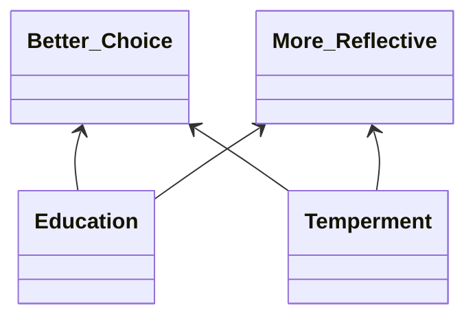

	# Info
**Title**: Comparing fast thinking and slow thinking: The relative benefits of interventions, individual differences, and inferential rules
**Journal**: Judgment and Decision Making
**Year**: 2020
**Authors**: [[M. Asher Lawson]], [[Richard P. Larrick]], [[Jack B. Soll]]

**Link**: [paperpile](chrome-extension://bomfdkbfpdhijjbeoicnfhjbdhncfhig/view.html?mp=wRlnvf9y)
**Tags**: #paper
**Rating**:

**Connections**:
[[individual differences]]
[[behavioral intervention]]
[[thesis intervention]]
[[dual-process model]]
[[rule based reasoning]]
[[cognitive reflection task]]
[[system 1]]
[[system 2]]
[[debiasing]]

# Notes
## Summary
Large scale study (1700 participants)
**Question**: Does ==slowing down== and accessing [[system 2]] really improve decisions?

[[Daniel Kahneman]] points out that if you don't have access to the necessary rule/algo for solving a problem, or recognize that the rule applies in a given situation then thinking more slowly is unlikely to help (2000).

Point out that while there is support for idea that people who are more reflective (trait) tend to be less prone to common decision bias (Frederick,2005; Oeschssler, Roider & Schmitz, 2009; Cokely & Kelley, 2009; Obrecht, Chapman & Gelman, 2009; Koehler & James, 2010), this does not mean that someone more prone can change by slowing down...

- some evidence suggests that people may reach correct answers by having ==good intuitions==, **rather than** by using ==deliberation== to correct bad intuitions (Thompson, Pennycook, Trippas& Evans, 2018; Raoelison, Thompson & De Neys, 2020)

- study focuses on [[statistical reasoning]]
- admit that questions have low [[ecological validity]]

**[[behavioral intervention|Behavioral Interventions]]**
[[internal behavioral intervention|Internal]] vs [[external behavioral intervention|External]]

- Authors point out that [[intuitive decision making]] can often be accurate.
	- i.e. fast [[system 1]] choices.

- [[mindware]]/[[cognitive capital]] discussed

## Thoughts
Interested in the [[rule based reasoning]] aspect.

What is a good intuition? Where does that come from? Isn't good intuition just a combination of having good [[mindware]] and good [[decision environment recognition]]?

# Resources