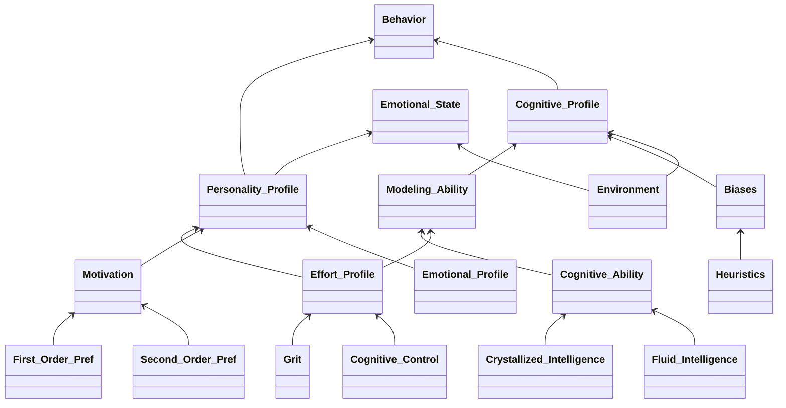

[[cognitive ability]]
[[cognitive biases]]
[[thesis]]

# Notes
How do we divide the constituents of human behavior?

Knowledge
Computational power
Personality
Environment

Rename `Cognitive_Profile` to `Potential`?

Biases correlates with decision algorithm selection ability
This ability 

- specify trait vs state
	- interactions between trait's and state susceptibiliy (e.g. fatigue)
- Decision environment enables decision possibilities

- Regulation
- Emotion/affect
- [[motivation|Motivation]]
- Decision environment

Modeling ability as algorithm selection? Or Cognitive Profile? Or Behavior?

>Heuristics are the "shortcuts" that humans use to reduce task complexity in judgment and choice, and biases are the resulting gaps between normative behavior and the heuristically determined behavior (Kahneman et al., 1982).

# Resources